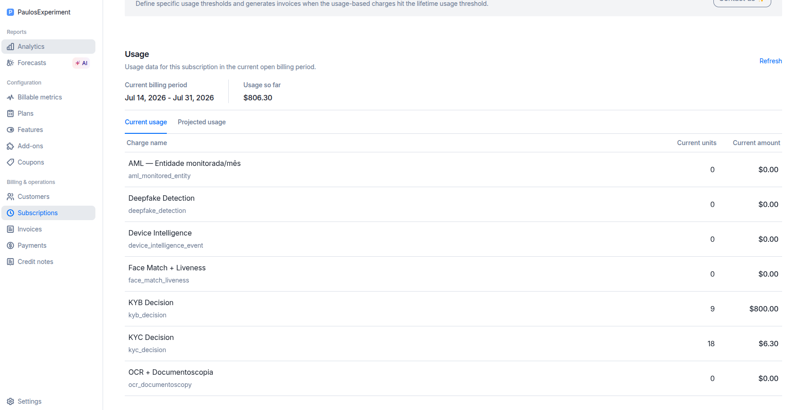

# KybExpansion

> Extensão de estudo sobre o Lago (usage-based billing open source), demonstrando como
> estender o sistema sem modificar nenhum arquivo original — princípio "fork e estende,
> nunca altera o core".

---

## O problema de negócio modelado

Em produtos de verificação de identidade B2B (KYC/KYB), uma decisão de **KYB**
(*Know Your Business*) não é atômica internamente: ela exige rastrear a estrutura
societária até identificar os **UBOs** (*Ultimate Beneficial Owners* — beneficiários
finais), aplicando uma verificação de **KYC** para cada um deles.

Um sistema de billing que recebe apenas "1 decisão de KYB" como unidade de cobrança
perde a granularidade real de custo e volume de KYC associado.

**A extensão resolve isso:** ao receber um evento `kyb_decision` no Lago, expande
automaticamente em N eventos derivados `kyc_decision` — um por UBO — com rastreabilidade
completa entre evento pai e eventos filhos.

> ⚠️ **Premissa simulada:** o contrato de entrada (`properties.ubo_ids`) é assumido
> como `{"ubo_ids": ["uuid1", "uuid2", ...]}`. Não há integração real com nenhum
> produto de KYB — este é um exercício técnico conceitual.

---

## 🎥 Demonstração em vídeo



▶ Walkthrough completo no YouTube — clique na thumbnail abaixo para assistir:

[](https://youtu.be/QIyx00X51kE)

---

## Princípio arquitetural: estender sem alterar o núcleo

O Lago é mantido ativamente upstream (`getlago/lago-api`). Editar arquivos originais
cria dívida de merge que cresce a cada `git pull`. A estratégia adotada:

- **Namespace próprio**: todo o código novo vive sob `KybExpansion`
- **Mínima edição de arquivos core**: apenas 8 linhas em `karafka.rb` para registrar o consumer
- **Zero alteração de lógica de negócio do Lago**

Isso permite sincronizar com o upstream com `git merge main` sem conflitos estruturais.

---

## Arquitetura atual

### Visão geral do fluxo

```
POST /api/v1/events  (single)  ─┐
POST /api/v1/events/batch       ─┤──→ Events::KafkaProducerService
                                 │         │
                                 │         └──→ LAGO_KAFKA_RAW_EVENTS_TOPIC
                                 │                   │
                                 │    Redpanda Connect (kyb_filter pipeline)
                                 │    filter: code == "kyb_decision"
                                 │                   │
                                 │                   └──→ LAGO_KAFKA_KYB_DECISION_EVENTS_TOPIC
                                 │                              │
                                 │              KybDecisionEventConsumer
                                 │                              │
                                 │              KybExpansionFromPayloadJob
                                 │                              │
                                 └──────────────────────────────┘
                                               ↓
                               Events::CreateService.call (N vezes)
                               code: "kyc_decision", um por UBO
```

O `Events::KafkaProducerService` é chamado em **todos** os paths de ingestão —
single event, batch, PostgreSQL store, ClickHouse store — tornando o Kafka o único
ponto de extensão que garante cobertura completa.

### Por que Redpanda Connect como pré-filtro

Sem o filtro, o consumer leria **todos** os eventos do tópico raw para descartar a
maioria. Em deployments de alto volume, isso desperdiça CPU, memória e banda
proporcionalmente ao volume total de eventos — não ao volume de KYB decisions.

O pipeline Redpanda Connect (`kyb-expansion/redpanda_connect_kyb_filter.yaml`) resolve
isso a nível de infraestrutura: apenas eventos `kyb_decision` chegam ao
`LAGO_KAFKA_KYB_DECISION_EVENTS_TOPIC`. O consumer não precisa filtrar — recebe
exclusivamente o que precisa processar.

### O consumer (`app/consumers/kyb_expansion/kyb_decision_event_consumer.rb`)

Consome `LAGO_KAFKA_KYB_DECISION_EVENTS_TOPIC` com consumer group próprio
(`kyb_expansion_kyb_decision_consumer`), garantindo offset independente sem
interferir com outros consumers do Lago. Verifica a feature flag
`KYB_EXPANSION_ENABLED` e enfileira `KybExpansionFromPayloadJob`.

### O job (`app/jobs/kyb_expansion/kyb_expansion_from_payload_job.rb`)

Trabalha diretamente com o payload Kafka — sem carregar o `Event` do banco —
o que o torna compatível com ClickHouse store. Para cada UBO em
`properties["ubo_ids"]`, chama `Events::CreateService.call` com:
- `code: "kyc_decision"`
- `transaction_id: "#{parent_transaction_id}_ubo_#{index}"` (determinístico)
- `properties: { derived_from: parent_transaction_id, ubo_id: ubo_id }`

### Idempotência

O banco impõe `UNIQUE INDEX index_unique_transaction_id ON events(organization_id, external_subscription_id, transaction_id)`. O `CreateService` captura a violação como `value_already_exist` (não como exceção). O job usa `.call` (não `.call!`), portanto reprocessar é um no-op silencioso — sem duplicatas, sem erros.

---

## Estrutura de arquivos

```
# Infraestrutura de filtragem
kyb-expansion/redpanda_connect_kyb_filter.yaml              # pipeline Redpanda Connect

# Consumer e job (abordagem atual)
karafka.rb                                                  # +8 linhas (único arquivo core editado)
app/consumers/kyb_expansion/kyb_decision_event_consumer.rb
app/jobs/kyb_expansion/kyb_expansion_from_payload_job.rb
spec/kyb_expansion/kyb_decision_event_consumer_spec.rb
spec/kyb_expansion/kyb_expansion_from_payload_job_spec.rb

# Abordagem anterior via prepend (histórico)
config/initializers/kyb_expansion.rb
app/services/kyb_expansion/expand_kyb_decision.rb
app/jobs/kyb_expansion/kyb_expansion_job.rb
spec/kyb_expansion/expand_kyb_decision_spec.rb
spec/kyb_expansion/kyb_expansion_job_spec.rb

# Documentação e demo
kyb-expansion/README.md
kyb-expansion/demo_catalog_setup.sh
```

---

## Como rodar localmente

### Pré-requisitos

Este repo (`lago-api`) deve estar dentro de um fork do `lago` com a branch `kyb-expansion`
que contém o override de docker-compose em `kyb-expansion/docker-compose.kyb-expansion.yml`.

### Variáveis de ambiente

Adicione em `lago/.env.development`:

```bash
KYB_EXPANSION_ENABLED=true
LAGO_KAFKA_KYB_DECISION_EVENTS_TOPIC=kyb_decision_events
```

### Subir o stack com o pipeline de filtragem

A partir da pasta raiz `lago/`:

```bash
docker compose -f docker-compose.dev.yml -f kyb-expansion/docker-compose.kyb-expansion.yml up -d
```

Isso sobe o stack completo + dois serviços extras:
- `kyb-expansion-topics` — cria o tópico `kyb_decision_events` (idempotente, encerra sozinho)
- `kyb-expansion-filter` — Redpanda Connect lendo `events-raw` e escrevendo `kyb_decision_events`

### Catálogo de demo

```bash
bash api/kyb-expansion/demo_catalog_setup.sh
```

Cria: billable metrics (`kyb_decision`, `kyc_decision`, etc.), plano `identity_platform_demo`,
cliente `demo_customer_001` com subscription `demo_customer_001_sub`.

### Rodar os testes

```bash
lago exec api bundle exec rspec spec/kyb_expansion/
```

### Validação manual

```bash
# Disparar evento kyb_decision com 3 UBOs
curl -s --location --request POST "$LAGO_URL/api/v1/events" \
  --header "Authorization: Bearer $LAGO_API_KEY" \
  --header 'Content-Type: application/json' \
  --data-raw '{
    "event": {
      "transaction_id": "manual_test_kyb_'"$(date +%s)"'",
      "external_subscription_id": "demo_customer_001_sub",
      "code": "kyb_decision",
      "properties": { "ubo_ids": ["ubo_1", "ubo_2", "ubo_3"] }
    }
  }'

# Confirmar no banco
lago exec api bundle exec rails console
# Event.where("transaction_id LIKE ?", "manual_test_kyb_%").pluck(:transaction_id, :code)
# Esperado: 1 kyb_decision + 3 kyc_decision (_ubo_0, _ubo_1, _ubo_2)

# Confirmar nas métricas de uso
curl -s "$LAGO_URL/api/v1/customers/demo_customer_001/current_usage?external_subscription_id=demo_customer_001_sub" \
  --header "Authorization: Bearer $LAGO_API_KEY" | \
  jq '.customer_usage.charges_usage[] | {units, name: .billable_metric.name}'
# kyc_decision deve mostrar 3 unidades
```

---

## Resultado dos testes automatizados

```
KybExpansion::KybDecisionEventConsumer
  #consume
    when KYB_EXPANSION_ENABLED is true
      enqueues KybExpansionFromPayloadJob with the message payload
    when KYB_EXPANSION_ENABLED is not set
      does not enqueue KybExpansionFromPayloadJob

KybExpansion::KybExpansionFromPayloadJob
  #perform
    when payload has 3 UBOs
      creates exactly 3 kyc_decision events
      creates events with deterministic transaction_ids
      sets derived_from and ubo_id in each child event properties
      sets external_subscription_id equal to the parent event
    when ubo_ids is absent from properties
      does not create any events
      logs a warning
      does not raise
    when ubo_ids is an empty array
      does not create any events
      logs a warning
    when the job runs twice for the same payload (idempotency)
      does not duplicate kyc_decision events
      does not raise on the second run

31 examples, 0 failures (inclui specs das abordagens anteriores)
```

## Resultado da validação manual

### Eventos no banco após disparo com 3 UBOs

```ruby
Event.where("transaction_id LIKE ?", "manual_test_kyb_%").pluck(:transaction_id, :code)
# [["manual_test_kyb_1784049805", "kyb_decision"],
#  ["manual_test_kyb_1784049805_ubo_0", "kyc_decision"],
#  ["manual_test_kyb_1784049805_ubo_1", "kyc_decision"],
#  ["manual_test_kyb_1784049805_ubo_2", "kyc_decision"]]
```

### Métricas de uso após expansão

```json
{ "units": "3.0", "name": "kyc_decision" }
{ "units": "2.0", "name": "kyb_decision" }
```

### Idempotência confirmada

Reenviar o mesmo `transaction_id` do evento pai não gerou duplicatas.

### Flag desligada

Com `KYB_EXPANSION_ENABLED` ausente: nenhum evento `kyc_decision` derivado foi gerado.
